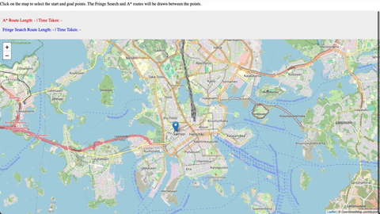

# RouteOptimizer

 [](https://codecov.io/github/sampsaoinonen/TiRa-RouteOptimizer)




**RouteOptimizer** is a navigational tool that uses and compares A* and Fringe Search pathfinding algorithms to find the most efficient route in [Helsinki capital region](https://en.wikipedia.org/wiki/Helsinki_capital_region) street network. The project allows users to simulate and visualize shortest path searches and evaluate the performance of used algorithms.

  

This project is part of the **Helsinki University course**: _Aineopintojen harjoitustyö: Algoritmit ja tekoäly TKT20010_.

---

## Documentation
- [Specifications](./documentation/specifications.md)
- [Testing](./documentation/testing.md)
- [Implementation](./documentation/implementation.md)
- [User Guide](./documentation/user_guide.md)

## Weekly Reports
- [Week 1](./documentation/week1.md)
- [Week 2](./documentation/week2.md)
- [Week 3](./documentation/week3.md)
- [Week 4](./documentation/week4.md)
- [Week 5](./documentation/week5.md)
- [Week 6](./documentation/week6.md)

# Quick Guide

## Command Line Operations

### Installation

Clone the repository, navigate to the project's root directory and install the dependencies with the command:
```bash
poetry install
```


### Running the Main Program
To run the main program, execute the following command:
```bash
poetry run invoke start
```

Wait for OSMnx maps to load and open your browser in **http://127.0.0.1:5000**

### Testing

All tests can be executed with the following command
```bash
poetry run invoke all-tests
```

Unit tests can be executed with the following command
```bash
poetry run invoke unit-tests
```

Integration tests can be executed with the following command
```bash
poetry run invoke integration-tests
```

Performance tests can be executed with the following command

```bash
poetry run invoke performance-tests
```

Rest of the tests **wihtout performance testing**: (Note that performance test takes couple minutes to finish)

```bash
poetry run invoke tests
```

### Test coverage

To generate a test coverage report as html and show in terminal, use the following commands:
```bash
poetry run invoke coverage-report
```
