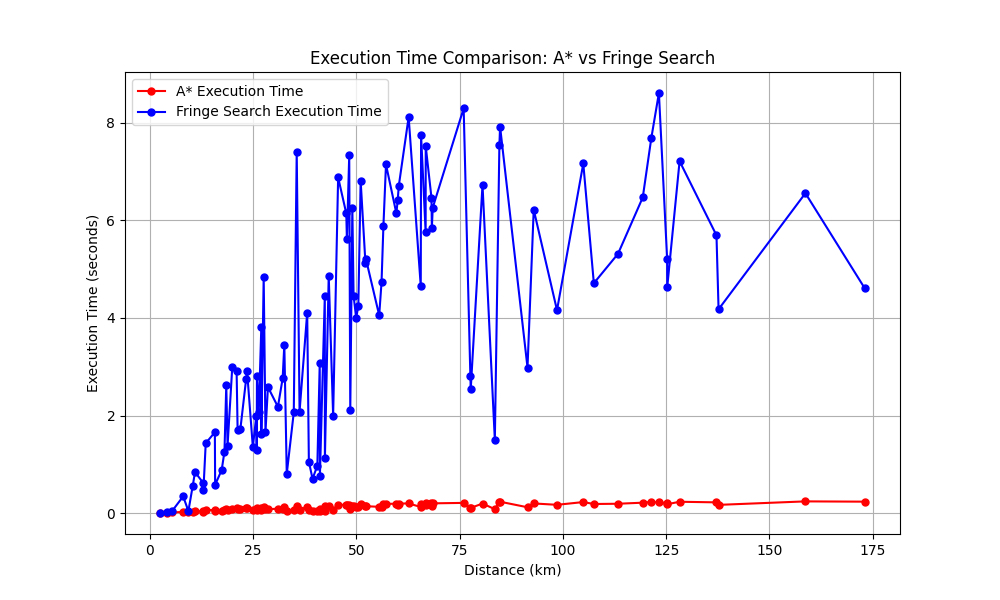

# Implementation Document

## General Structure of the Program

The program consists of three main components:

1. **Algorithms**: This module contains the implementations of the **A\*** algorithm and the **Fringe Search** algorithm for finding the shortest path on a geographic graph. Both algorithms operate on graphs generated using OpenStreetMap (OSM) data, accessed through the **OSMnx** library.
   - **AStarOSMnx**: Implements the A\* algorithm with heuristic-based pathfinding, designed for geographic graphs. It utilizes Euclidean distance as the heuristic.
   - **FringeSearchOSMnx**: Implements the Fringe Search algorithm, which is a more memory-efficient alternative to A\*, suitable for large graphs.
   
2. **Utility Functions**: Includes helper methods for calculating distances and manipulating graph data.
   - **graph_utils**: Contains functions for calculating distances (Euclidean) and computing edge lengths.
   - **osm_utils**: Functions for downloading graphs from OSMnx and retrieving the nearest graph node based on coordinates.

3. **Frontend and Backend**: 
   - **Frontend**: Built using **Leaflet.js** for interactive maps. Users can select start and goal points, and the interface displays the calculated routes, their lengths, and the time taken by both A\* and Fringe Search algorithms.
   - **Backend**: Built with **Flask**. The backend processes the route requests and returns route data for both algorithms. The OSM graph is processed server-side.

The program uses **integration tests**, **performance tests** and **unit tests** to ensure correctness of both algorithms and their utility functions. These tests compare the path lengths found by A* and Fringe Search with **Dijkstra’s algorithm** for validation. More on [testing](./testing.md) documentation.

## Achieved Time and Space Complexities

#### A*

- **Time Complexity**: O((|E| + |V|) log |V|), where |E| is the number of edges and |V| is the number of nodes. This time complexity arises from the operations of the priority queue (e.g., heapq).
- **Space Complexity**: O(|V|), because A* stores information for each node (g-values, f-values, and parent nodes).

#### Fringe Search

## Performance Comparison and O-Analysis
The performance of A* and Fringe Search was analyzed through both unit and integration tests. Performance testing focused on comparing the execution time and memory usage of each algorithm on a large, real-world map (Uusimaa region).

### Performance Results:

- **A_star**: In most cases, A* was faster in terms of execution time, especially for shorter paths or when the graph had fewer complex connections.
- **Fringe Search**: This algorithm showed a smaller memory footprint but was slower in some cases due to the deferred expansion mechanism, particularly on large graphs.

Both algorithms were benchmarked against Dijkstra’s algorithm, which served as a reference for correctness and performance validation. While Dijkstra guarantees the shortest path, its lack of heuristic guidance makes it slower than both A* and Fringe Search.

  

## Use of Large Language Models (LLMs)

**ChatGPT 4o**, has been used for:
- **Documentation support**: Assistance in structuring both testing and implementation documents, ensuring good English and usage of Google-style docstring conventions.
- **Best practices**: what to test for improved test coverage, how handle integration between frontend and backend components. etc.
- **Bug finding**: Guidance on resolving issues mainly caused by type errors
- **Available technologies**: Suggestions on different available technologies and their pros and cons(helped pick **Leaflet**, **OSMnx**)
- **To explain**: To simplify parts of difficult scientific texts like in [fringe](https://webdocs.cs.ualberta.ca/~holte/Publications/fringe.pdf) and explain code/algorithms with comments and examples.

### References

1. Björnsson, Y., Enzenberger, H., Holte, R. C., Schaeffer, J (2005). Fringe Search: Beating A* at Pathfinding on Game Maps. Retrieved from [https://webdocs.cs.ualberta.ca/~holte/Publications/fringe.pdf](https://webdocs.cs.ualberta.ca/~holte/Publications/fringe.pdf)

2. Fringe Search. (n.d.). In Wikipedia. Retrieved September 28, 2024, from [https://en.wikipedia.org/wiki/Fringe_search](https://en.wikipedia.org/wiki/Fringe_search)

3. A* Search Algorithm. (n.d.). In Wikipedia. Retrieved September 28, 2024, from [https://en.wikipedia.org/wiki/A*_search_algorithm](https://en.wikipedia.org/wiki/A*_search_algorithm)

4. Tech With Tim. (2020, May 14). A* Pathfinding Algorithm - Python Tutorial. YouTube. Retrieved from [https://www.youtube.com/watch?v=-L-WgKMFuhE](https://www.youtube.com/watch?v=-L-WgKMFuhE)