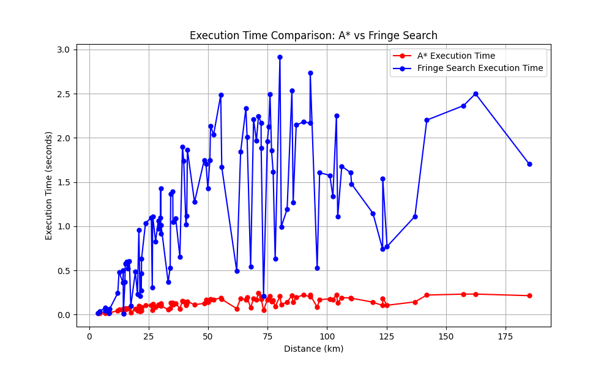

# Implementation Document

## General Structure of the Program

The program consists of three main components:

1. **Algorithms**: This module contains the implementations of the **A\*** algorithm and the **Fringe Search** algorithm for finding the shortest path on a geographic graph. Both algorithms operate on graphs generated using OpenStreetMap (OSM) data, accessed through the **OSMnx** library.
   - **AStarOSMnx**: Implements the A\* algorithm with heuristic-based pathfinding, designed for geographic graphs. It utilizes Euclidean distance as the heuristic.
   - **FringeSearchOSMnx**: Implements the Fringe Search algorithm, which is a more memory-efficient alternative to A\*, suitable for large graphs.
   
2. **Utility Functions**: Includes helper methods for calculating distances and manipulating graph data.
   - **graph_utils**: Contains functions for calculating distances (Euclidean) and computing edge lengths.
   - **osm_utils**: Functions for downloading graphs from OSMnx and retrieving the nearest graph node based on coordinates.

3. **Frontend and Backend**: 
   - **Frontend**: Built using **Leaflet.js** for interactive maps. Users can select start and goal points, and the interface displays the calculated routes, their lengths, and the time taken by both A\* and Fringe Search algorithms.
   - **Backend**: Built with **Flask**. The backend processes the route requests and returns route data for both algorithms. The OSM graph is processed server-side.

The program uses **integration tests**, **performance tests** and **unit tests** to ensure correctness of both algorithms and their utility functions. These tests compare the path lengths found by A* and Fringe Search with **Dijkstra’s algorithm** for validation. More on [testing](./testing.md) documentation.

## Fringe Search versions

In the article, the Fringe Search algorithm used a doubly linked list as its data structure. I implemented several versions of this approach myself, which produced correct results according to the tests. However, it performed at best as well as the final deque (double-ended queue) solution, and on some routes, it was noticeably slower. For this reason, I decided to use Python's native deque due to its slightly simpler structure and because, as a built-in data structure, it doesn't need to be tested separately.

I also experimented with creating a modified version of Fringe Search, which can be found in the branch [fringe_with_heuristic_cache](https://github.com/sampsaoinonen/TiRa-RouteOptimizer/tree/fringe_with_heuristic_cache). Categorizing this version as Fringe Search can be, however, questionable in some ways. Fringe Search does not seem to typically employ heuristic caching, as it focuses on exploring nodes iteratively by thresholding f values without pre-computed lookups for efficiency. Thus, the introduction of a heuristic cache changes the algorithm's structure and prioritization strategy, potentially blurring the boundaries of what can be called an Fringe Search. Anyway this version outperformed more pseudocode-like version of Fringe as can be seen in the graps below.

## Achieved Time and Space Complexities

#### A*

- **Time Complexity**: O((|E| + |V|) log |V|), where |E| is the number of edges and |V| is the number of nodes. This time complexity arises from the operations of the priority queue (e.g., heapq).
- **Space Complexity**: O(|V|), because A* stores information for each node (g-values, f-values, and parent nodes).

#### Fringe Search Algorithm

- **Time Complexity**: The worst-case complexity is similar to A* in terms of node exploration but defers some expansions to future iterations, which can sometimes increase time overhead.
- **Space Complexity**: O(|V|), but it can be more memory-efficient than A* in practice due to how it manages the frontier (or fringe) nodes.

## Performance Comparison and O-Analysis
The performance of A* and Fringe Search was analyzed through both unit and integration tests. Performance testing focused on comparing the execution time and memory usage of each algorithm on a large, real-world map (Uusimaa region).

### Performance Results:

- **A_star**: In most cases, A* was faster in terms of execution time, especially for shorter paths or when the graph had fewer complex connections.
- **Fringe Search**: This algorithm showed a smaller memory footprint but was slower in some cases due to the deferred expansion mechanism, particularly on large graphs.

Both algorithms were benchmarked against NetworkX's implementation of Dijkstra’s algorithm, which was used as a reference to validate correctness.

### Achieved Results:

**A_star vs Fringe Search**

**A_star vs Fringe Search with Heuristic Cache**

  

## Limitations and Suggestions for Improvements

1. **Optimization of Fringe Search**: Despite numerous attempts to optimize Fringe Search, it remains slower than A* in most cases. Some kind of hybrid approaches could improve its speed but it can be controversal if the algorithm can be labeled as Fringe Search after all the changes.
2. **Handling larger graphs**: The current implementation processes medium to large graphs, but for very large geographic regions, further memory optimizations or parallel processing techniques could improve performance.
3. **GUI enhancements**: The frontend could be enhanced with more interactive features, such as dynamically updating the routes when the user choose between walk, bike or car routes.
4. **Monitoring memory usage**:  Including a feature to monitor and display memory usage for different algorithms during the route calculation would provide users with more insights, especially in comparing the efficiency of the algorithms
5. **Comparing heurestics**:  The application could be extended to allow users to choose and compare different heuristics, such as Manhattan, Euclidean, or Haversine distances. This would enable users to evaluate the performance and accuracy of the algorithms under different conditions and heuristics, providing a richer comparison between pathfinding strategies.

## Use of Large Language Models (LLMs)

**ChatGPT 4o**, has been used for:
- **Documentation support**: Assistance in structuring both testing and implementation documents, ensuring good English and usage of Google-style docstring conventions.
- **Best practices**: what to test for improved test coverage, how handle integration between frontend and backend components. etc.
- **Bug finding**: Guidance on resolving issues mainly caused by type errors
- **Available technologies**: Suggestions on different available technologies and their pros and cons(helped pick **Leaflet**, **OSMnx**)
- **To simplify and explain**: To simplify parts of difficult scientific texts like in [fringe](https://webdocs.cs.ualberta.ca/~holte/Publications/fringe.pdf) and explain code/algorithms with comments and examples.

### References

1. Björnsson, Y., Enzenberger, H., Holte, R. C., Schaeffer, J (2005). Fringe Search: Beating A* at Pathfinding on Game Maps. Retrieved from [https://webdocs.cs.ualberta.ca/~holte/Publications/fringe.pdf](https://webdocs.cs.ualberta.ca/~holte/Publications/fringe.pdf)

2. Fringe Search. (n.d.). In Wikipedia. Retrieved September 28, 2024, from [https://en.wikipedia.org/wiki/Fringe_search](https://en.wikipedia.org/wiki/Fringe_search)

3. A* Search Algorithm. (n.d.). In Wikipedia. Retrieved September 28, 2024, from [https://en.wikipedia.org/wiki/A*_search_algorithm](https://en.wikipedia.org/wiki/A*_search_algorithm)

4. Tech With Tim. (2020, May 14). A* Pathfinding Algorithm - Python Tutorial. YouTube. Retrieved from [https://www.youtube.com/watch?v=-L-WgKMFuhE](https://www.youtube.com/watch?v=-L-WgKMFuhE)